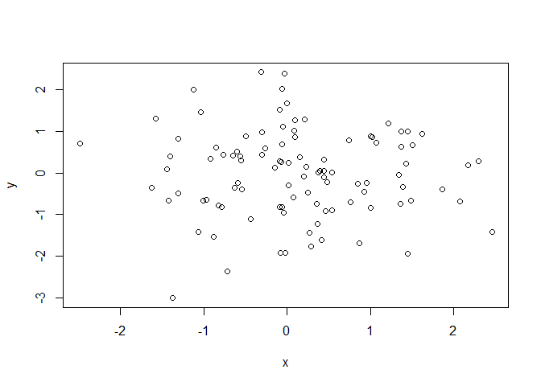
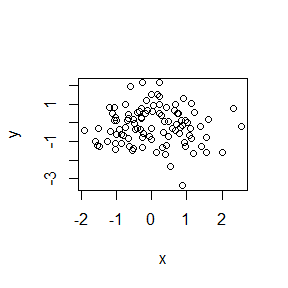

hw01\_gapminder
================

Level 1 header
==============

Header
------

``` r
x<- rnorm(100)
y<- rnorm(100)
plot(x,y)
```



``` r
summary(x)
```

    ##     Min.  1st Qu.   Median     Mean  3rd Qu.     Max. 
    ## -2.51294 -0.80190 -0.11100 -0.06155  0.59033  2.36794

``` r
x<- rnorm(100)
y<- rnorm(100)
plot(x,y)
```


