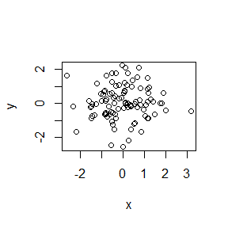

hw01\_gapminder
================

Level 1 header
==============

Header
------

``` r
x<- rnorm(100)
y<- rnorm(100)
plot(x,y)
```


``` r
summary(x)
```

    ##     Min.  1st Qu.   Median     Mean  3rd Qu.     Max. 
    ## -2.48676 -0.56990  0.04827  0.12384  0.78169  2.46012

``` r
x<- rnorm(100)
y<- rnorm(100)
plot(x,y)
```



``` r
library(gapminder)
head(gapminder)
```

    ##       country continent year lifeExp      pop gdpPercap
    ## 1 Afghanistan      Asia 1952  28.801  8425333  779.4453
    ## 2 Afghanistan      Asia 1957  30.332  9240934  820.8530
    ## 3 Afghanistan      Asia 1962  31.997 10267083  853.1007
    ## 4 Afghanistan      Asia 1967  34.020 11537966  836.1971
    ## 5 Afghanistan      Asia 1972  36.088 13079460  739.9811
    ## 6 Afghanistan      Asia 1977  38.438 14880372  786.1134

``` r
str(gapminder)
```

    ## Classes 'tbl_df', 'tbl' and 'data.frame':    1704 obs. of  6 variables:
    ##  $ country  : Factor w/ 142 levels "Afghanistan",..: 1 1 1 1 1 1 1 1 1 1 ...
    ##  $ continent: Factor w/ 5 levels "Africa","Americas",..: 3 3 3 3 3 3 3 3 3 3 ...
    ##  $ year     : int  1952 1957 1962 1967 1972 1977 1982 1987 1992 1997 ...
    ##  $ lifeExp  : num  28.8 30.3 32 34 36.1 ...
    ##  $ pop      : int  8425333 9240934 10267083 11537966 13079460 14880372 12881816 13867957 16317921 22227415 ...
    ##  $ gdpPercap: num  779 821 853 836 740 ...
